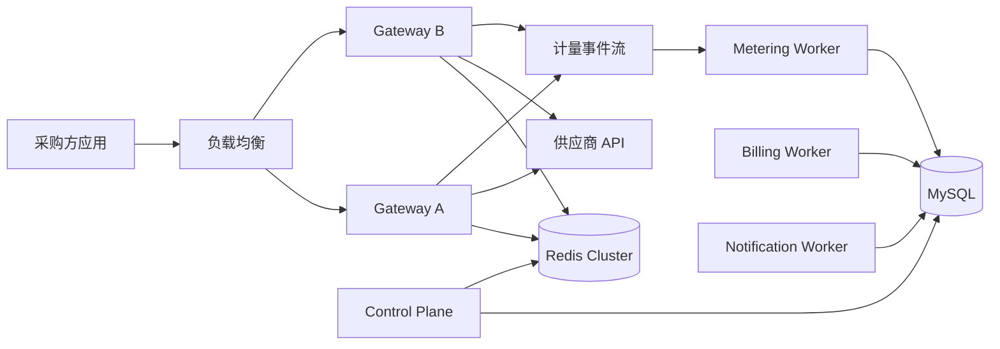
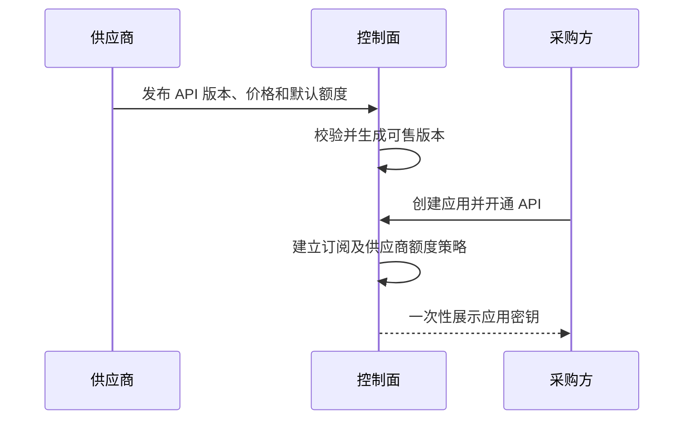
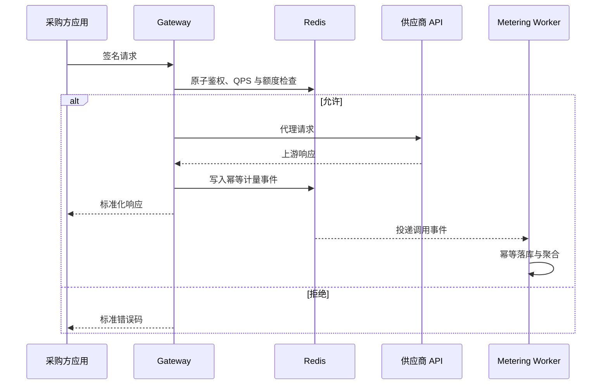

# UniAPI 统一接口平台系统规范

> 本文档是系统架构、产品规则和开发规范的唯一事实来源。所有新会话和接力 agent 必须先完整阅读本文档，再到 `uniapi_mission.md` 查找当前唯一任务。不得恢复 `progress.md` 或 `docs/` 计划目录。

## 1. 产品定位与一期边界

UniAPI 是接口买卖平台：供应商发布 API，采购方创建应用并开通 API，所有调用通过平台统一网关转发、计量和审计。

一期已确认规则：

1. 采购方注册后自动开通平台能力，不设置人工准入。
2. API 采用按实际调用量后付费、按月出账。
3. 供应商可按 API 和采购方配置 QPS、周期用量额度，后台可调整。
4. 账单逾期后进入固定宽限期，宽限期结束仍未确认付款则暂停调用。
5. 一期使用账单、付款凭证、平台人工确认，不接在线支付。
6. 平台按供应商配置佣金比例，佣金变更必须审计。
7. 接口密钥只在创建或重置时展示一次，平台不保存可直接读取的明文。

## 2. 身份与权限边界

- 普通用户使用 `users`，可拥有采购方或供应商业务身份。
- 管理员使用 `admin_users`，与普通用户严格分表、分认证、分会话。
- 永久超级管理员用户名为 `welkin`；初始化命令生成随机临时密码，仅在终端展示一次。
- 超管首次登录必须改密；改密前仅能进入改密和退出路由。
- 普通管理员与角色为多对多，最终权限是所有启用角色下启用权限的并集。
- 系统权限由路由元数据同步；新增路由新增授权项，移除路由停用授权项。后台可创建自定义权限，路由同步不得覆盖。
- 菜单完全由后台配置，菜单可见性不能替代服务端权限校验。
- 操作日志全量写入 MySQL、永久保存、只追加、不可编辑或删除。

## 3. 技术框架

- 运行时：PHP 8.1+、Hyperf 3.1、Swoole。
- 数据库：MySQL 是账号、订单、账单、额度配置和审计记录的最终事实来源。
- 高速状态：Redis 保存会话、限流计数、短周期用量、幂等键、队列和分布式协调状态。
- Web：沿用现有服务端渲染后台，深色终端风格、等宽字体、绿色状态色、清晰焦点和响应式布局。
- 质量：PHPUnit、Mockery、PHPStan；所有行为按 RED → GREEN → REFACTOR 实施。
- 架构：一个 Hyperf 代码库按领域模块化，通过进程角色按功能独立部署；一期不拆多仓库微服务，但边界必须可解耦。

## 4. 目录职责

当前目录：

- `app/Controller/`：HTTP 入口，只做协议解析、校验和响应编排。
- `app/Service/`：现有业务服务；新增 UniAPI 领域代码逐步迁移到领域目录。
- `app/Middleware/`：认证、改密、权限、请求追踪、限流和审计边界。
- `app/Rbac/`：后台路由权限定义、注册表和同步逻辑。
- `app/View/`：服务端渲染页面与终端风格组件。
- `app/Command/`：Schema、超管初始化、权限同步和运维命令。
- `config/routes.php`：路由注册入口；后台路由必须携带权限元数据。
- `config/autoload/`：数据库、Redis、进程角色及模块配置。
- `test/Cases/`：与生产行为一一对应的单元和 HTTP 测试。

目标领域模块：

- `Identity`：普通用户、管理员、采购方/供应商身份、认证和密钥。
- `Catalog`：API 商品、版本、文档、定价和发布状态。
- `Subscription`：采购方应用、开通关系、供应商额度策略。
- `Gateway`：鉴权、路由、QPS/额度判定、上游转发和标准化响应。
- `Metering`：不可重复的调用计量、聚合和对账。
- `Billing`：月账单、宽限期、暂停与恢复。
- `Settlement`：付款凭证、人工确认、供应商结算和佣金。
- `Admin`：RBAC、菜单、管理员和永久审计。

领域之间通过明确的服务接口、领域事件和稳定数据契约协作，禁止跨模块随意读写内部表。

## 5. 可分布式部署设计

同一构建产物通过 `APP_ROLE` 选择进程职责：

- `control-plane`：Web、管理后台、商品、应用、账单和配置接口。
- `gateway`：低延迟鉴权、限流、额度判定和上游代理。
- `metering-worker`：消费调用事件、幂等落库和用量聚合。
- `billing-worker`：月度出账、宽限期扫描、暂停与恢复。
- `notification-worker`：账单、额度和异常通知。
- `all-in-one`：本地与小规模部署，启用全部职责。

Gateway 不依赖 Web 会话和页面进程；worker 可横向扩容；配置更新通过版本号和事件失效缓存。

## 6. Redis 分布式结果规范

1. 限流和额度“检查 + 扣减”必须用 Lua 原子执行，禁止多条非原子命令拼接。
2. Redis Cluster 需要共同操作的键使用 hash tag，例如 `quota:{subscription_id}:202607`。
3. 热路径禁止 `KEYS`，也不以全库 `SCAN` 作为正确性依赖。
4. 分布式任务使用租约锁/任务所有权；MySQL 唯一约束和 fencing token 负责最终防重。
5. Stream 消费者必须幂等；事件带 `event_id`，落库用唯一键抵御重复投递。
6. 限流、额度或鉴权状态不可判定时默认拒绝调用，不能放行产生无法计费的请求。
7. MySQL 保存最终用量和账务事实；Redis 数据必须能从数据库、配置和事件重建。
8. 缓存键必须带租户/应用/订阅维度和版本，配置变更后主动失效，TTL 作为兜底。
9. 月结边界使用明确时区和账期 ID，避免节点时间差造成重复或漏算。

## 7. 核心流程

### 7.1 发布与开通

### 7.2 调用与计量

### 7.3 出账与结算

月末按不可变计量明细生成账单快照，计算平台佣金和供应商应结金额。采购方上传付款凭证，管理员确认后恢复结算状态；逾期进入宽限期，期满暂停相关订阅。

## 8. Web 优先交付规范

每个业务阶段优先形成可访问、可观察的 Web 页面，再补齐服务和持久化，使真人可以尽早介入指导：

1. 先写页面行为测试并看到 RED。
2. 实现终端风格页面和真实导航入口，明确展示尚未接通的数据。
3. 再接控制器、领域服务、数据库和 Redis。
4. 页面不得伪造“成功”状态；未实现功能必须禁用或显示真实状态。
5. 完成阶段测试、静态分析、任务记录、中文提交并推送 `origin main`。

## 9. 数据、安全与审计硬约束

- 本次新增或调整的所有业务表、关联表、审计表必须包含 `created_at`、`updated_at`、`deleted_at`；`deleted_at` 默认 NULL。
- 审计表保留三个字段，但业务层不得更新或软删除审计记录。
- 主键沿用项目雪花 ID；金额使用定点小数或最小货币单位整数，禁止浮点计算。
- 写操作使用 POST 并校验 CSRF；无权访问返回 403。
- 密码、Cookie、Authorization、会话 Token、API Secret 和签名原文不得进入日志或审计参数。
- 管理员、权限、价格、额度、佣金、付款确认和暂停/恢复均需记录永久数据库审计。
- 写业务与审计应在同一 MySQL 事务；查询审计失败时返回 503，不能产生未留痕后台访问。

## 10. 开发、提交与接力规范

1. 开始工作先运行 `git status --short`，完整阅读本文档和 `uniapi_mission.md`。
2. 只执行 `uniapi_mission.md` 标明的“当前唯一任务”，不得自行跨阶段。
3. 每个行为严格执行 RED → GREEN → REFACTOR，并记录实际命令和结果。
4. 每完成一个可验证小步骤，先更新 `uniapi_mission.md`，包含文件、测试、风险和下一断点。
5. 每个完成步骤使用中文提交信息，并推送到 `origin main`。
6. 选择性暂存本步骤文件，不覆盖或夹带用户及其他 agent 的改动。
7. 禁止把密码、Token、密钥和付款敏感信息写入 Git。
8. 项目不使用 `docs/` 计划目录，也不再使用 `progress.md`；任务只从 `uniapi_mission.md` 获取。
